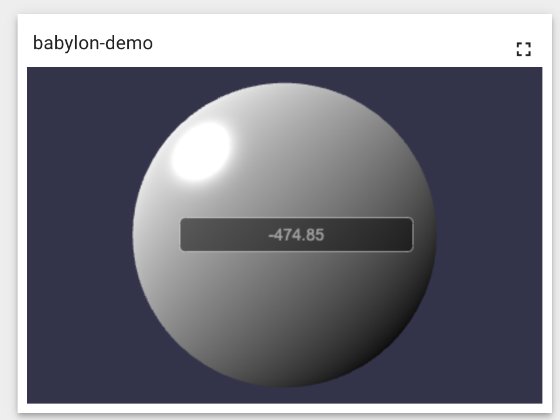

#### 环境准备

- release-3.3分支源码
- Yarn

#### 描述

研究如何在系统中增加3D引擎-[Babylon.js](https://www.babylonjs.com/)，使用3D引擎运行模型并关联数据，建议先了解[组件扩展](组件扩展.md)。

#### 开发

登录系统，点击菜单`部件库`，点击右上角`+`号新建名为`我的部件包`的部件库（也可选择已有部件包进行增加），点击进入`我的部件包`，点击右下角`+`号按钮，点击创建`新的部件类型`按钮，选择`最新值`，进入部件编辑页面。

##### 步骤一 标题

在左上角，填写部件标题：`babylon-demo`

##### 步骤二 资源

###### 方式一：标准扩展
因TB加载脚本为async（异步），多个脚本之间不能有依赖关系，下载`https://preview.babylonjs.com/babylon.js`、`https://preview.babylonjs.com/gui/babylon.gui.min.js`、`https://preview.babylonjs.com/loaders/babylonjs.loaders.js`，将文件合并为单个文件（babylon.mix.js）并发布出来
```shell
# 安装http-server
yarn -g http-server
# 启动
http-server -c-1
```
在左上`资源`Tab页中增加发布出来的地址：
```
http://ip:port/babylon.mix.js
```
###### 方式二：内置
在yarn中安装类库：
```shell
# 增加babylon.js核心库，当前最新稳定版4.2.0
yarn install babylonjs@4.2.0
# 增加babylon.js UI核心库
yarn add babylonjs-gui@4.2.0
# 增加babylon.js UI核心库
yarn add babylonjs-loaders@4.2.0
```
使用此种方式，webpack打包时，将会内置babylon引擎，`资源`Tab页中不需要添加任何内容。

##### 步骤三 HTML
粘贴以下脚本到左上`HTML`Tab页中：
```html
<canvas id="renderCanvas"></canvas>
```

##### 步骤四 CSS
粘贴以下脚本到左上`CSS`Tab页中：
```css
#renderCanvas {
    width: 100%;
    height: 100%;
    touch-action: none;
}
```

##### 步骤五 脚本
粘贴以下脚本到左下javascipt部分中：
```javascript
var engine;
var canvas;
var scene;
var text;

self.onInit = function() {
    canvas = document.getElementById("renderCanvas"); // Get the canvas element 
    engine = new BABYLON.Engine(canvas, true); // Generate the BABYLON 3D engine

    /******* Add the create scene function ******/
    var createScene = function () {

        // Create the scene space
        var scene = new BABYLON.Scene(engine);

        // Add a camera to the scene and attach it to the canvas
        var camera = new BABYLON.ArcRotateCamera("Camera", Math.PI / 2, Math.PI / 2, 2, new BABYLON.Vector3(0,0,5), scene);
        camera.attachControl(canvas, true);

        // Add lights to the scene
        var light1 = new BABYLON.HemisphericLight("light1", new BABYLON.Vector3(1, 1, 0), scene);
        var light2 = new BABYLON.PointLight("light2", new BABYLON.Vector3(0, 1, -1), scene);

        // Add and manipulate meshes in the scene
        var sphere = BABYLON.MeshBuilder.CreateSphere("sphere", {diameter:5}, scene);
        
        //Add advancedTexture
        var advancedTexture = BABYLON.GUI.AdvancedDynamicTexture.CreateFullscreenUI("UI");

        //Add label
        var label = new BABYLON.GUI.Rectangle("label for " + sphere.name);
        label.background = "black"
        label.height = "30px";
        label.alpha = 0.5;
        label.width = "200px";
        label.cornerRadius = 5;
        label.thickness = 1;
        label.linkOffsetY = -0;
        label.linkOffsetX = 10;
        advancedTexture.addControl(label); 
        label.linkWithMesh(sphere);

        text = new BABYLON.GUI.TextBlock();
        text.text = "Temperature:";
        text.color = "white";
        text.fontSize = 14;
        label.addControl(text);

        return scene;
    };
    /******* End of the create scene function ******/    
    
    
    //Call the createScene function
    scene = createScene();
        
    // Register a render loop to repeatedly render the scene
    engine.runRenderLoop(function () { 
        if (scene && scene.activeCamera) {
            scene.render();
        }
    });
}

self.onDataUpdated = function() {
    if (self.ctx.defaultSubscription.data[0].data.length) {
        var value = self.ctx.defaultSubscription.data[0].data[0][1];
        text.text = value+"";
    }
}

self.onResize = function() {
     engine.resize();  
}

self.onDestroy = function() {
   
}

```

##### 步骤六 运行

点击右上角`运行`按钮，测试组件。

##### 步骤七 保存

点击右上角`保存`按钮保存组件。

#### 验证

最终效果示意图：



**恭喜**你拥有了第一个3D组件，后续可以在dashboard中绑定数据源展示实时数据。


#### TIPS

- [**官方**]组件开发： https://thingsboard.io/docs/user-guide/contribution/widgets-development/
- [**官方**]BabylonJS：https://doc.babylonjs.com/
- [**官方**]BabylonJS入门：https://doc.babylonjs.com/start/chap1/first_scene
- [**官方**]BabylonJS示例：https://playground.babylonjs.com/#3VMTI9#0