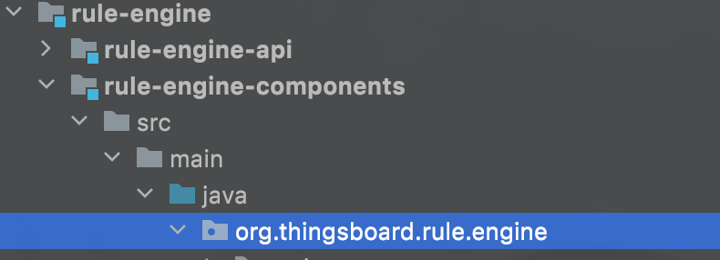

#### 环境准备

- release-3.3分支源码
- 企业微信：包含一个企业和一个测试应用。

#### 描述

增加用于发送消息到企业微信的节点

#### 开发

阅读本文前，请先了解如何进行[后端调试](../调试/后端.md)和[前端调试](../调试/前端.md)，建议也先阅读官方的[规则节点开发](https://thingsboard.io/docs/user-guide/contribution/rule-node-development/)。

##### 后端开发 

注意**并发访问控制**。

打开源码工程，进入`rule-engine-components`子工程，然后进入`src\main\java\org\thingsboard\rule\engine`下。



新建`command`文件夹，在`command`文件夹下新建Java文件TbSystemCommandNode用于处理消息

```java

```

在`command`文件夹下新建Java文件TbSystemCommandNodeConfiguration如下:

```java

```

在左侧代码树上我们应该能看到如下结构：

找到`ThingsboardServerApplication`运行工程，点击左侧菜单`规则链库`，随意进入一条规则链，在左侧菜单中可以找到`system command`规则节点。

将其拖拽到画布，可以看到如下信息：

##### 前端开发（暂未实现）

//todo


#### TIPS
- 如果遇到UI加载异常，可以删除数据库表`omponent_descriptor`关于··`TbSystemCommandNode`的一行记录，然后重启程序。

- [**官方**]规则节点开发： https://thingsboard.io/docs/user-guide/contribution/rule-node-development/
- [**官方**] 规则节点后端扩展工程地址：https://github.com/thingsboard/rule-node-examples.git
cd rule-node-examples
- [**官方**] 规则节点前端扩展工程地址：https://github.com/thingsboard/rule-node-examples-ui-ngx.git
- [**Fork**] 规则节点前端扩展工程地址：https://github.com/blackstar-baba/rule-node-examples-ui-ngx.git
- [**官方**] 规则节点UI地址：https://github.com/thingsboard/thingsboard-rule-config-ui-ngx
- [**Github**] SSH Key生成：https://docs.github.com/en/authentication/connecting-to-github-with-ssh
- [**官方**]ICON查找：https://fonts.google.com/icons?selected=Material+Icons

