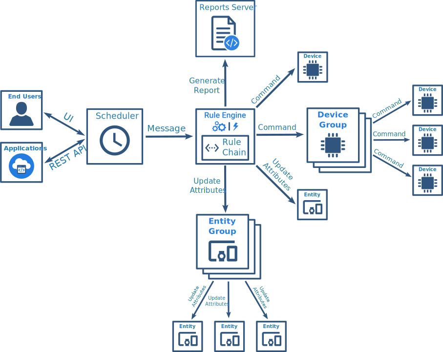

#### 环境准备

- release-3.3分支源码

#### 描述

增加定时任务，用于定时触发某些机制，比如消息、控制指令等。

#### 分析

官方介绍如下：

ThingsBoard 允许您通过灵活的时间表配置来安排各种类型的事件。ThingsBoard 调度器根据它们的调度触发配置的调度器事件。当调度程序事件被触发时，[规则引擎消息](https://thingsboard.io/docs/pe/user-guide/rule-engine-2-0/overview/#rule-engine-message)从具有与规则引擎消息相似结构的事件配置中生成。然后将生成的消息转发到[规则引擎](https://thingsboard.io/docs/pe/user-guide/rule-engine-2-0/re-getting-started/)并从[根规则链](https://thingsboard.io/docs/pe/user-guide/rule-engine-2-0/overview/#rule-chain)开始处理。

任务处理流程如下：

因此可以得到功能性需求：

- 任务调度器（调度任务）
- 可视化界面（列表以及日历）

从可用性角度出发，还需考虑以下非功能性需求：

- 性能
- 可靠性（尽可能不丢失任务，或者有补偿）
- 可扩展性（支持集群）

#### TIPS

- 因Thingsboard支持分布式部署，所以定时任务也需要支持分布式。