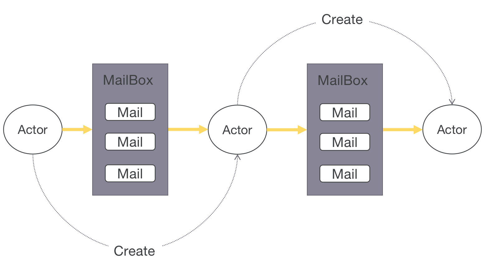

#### 环境准备

- release-3.2分支源码，可参考[编译](../编译/编译.md)


#### 描述

规则引擎是Thingsboard的核心部分，实时数据经过规则引擎进行处理并送至目的地。规则引擎的核心是Actor模型，在2.x版本中，Actor模型使用Akka实现，在3.x中官方自行实现。


##### 模型
开始分析之前，有必要先了解下Actor模型，维基百科的定义如下：

演员模型推崇的哲学是“一切皆是演员”，这与[面向对象编程](https://zh.wikipedia.org/wiki/面向对象编程)的“一切皆是对象”类似。
演员是一个运算实体，响应接收到的消息，相互间是[并发](https://zh.wikipedia.org/wiki/并发计算)的：
- 发送有限数量的消息给其他演员；
- 创建有限数量的新演员；
- 指定接收到下一个消息时要用到的行为。


系统中与Actor模型相关类都在工程`common/actor`下，几个核心类说明如下：
- DefaultTbActorSystem Actor系统，用于Dispatcher的创建删除、Actor的创建查找和Actor之间消息传递等。
- Dispatcher 调度器，用于调度Actor的创建或消息分发。
- TbActorMailbox 邮箱，存储消息到队列并使用调度器处理队列中的消息。

//todo 配图
##### 初始化
`DefaultActorService`构造一个使用Actor模型系统的规则引擎，分为两个阶段：  
1. 类初始化，方法为：`initActorSystem`
```
log.info("Initializing actor system.");
actorContext.setActorService(this);
TbActorSystemSettings settings = new TbActorSystemSettings(actorThroughput, schedulerPoolSize, maxActorInitAttempts);
//新建DefaultTbActorSystem对象
system = new DefaultTbActorSystem(settings);
//创建线程池用于后续异步处理消息
system.createDispatcher(APP_DISPATCHER_NAME, initDispatcherExecutor(APP_DISPATCHER_NAME, appDispatcherSize));
system.createDispatcher(TENANT_DISPATCHER_NAME, initDispatcherExecutor(TENANT_DISPATCHER_NAME, tenantDispatcherSize));
system.createDispatcher(DEVICE_DISPATCHER_NAME, initDispatcherExecutor(DEVICE_DISPATCHER_NAME, deviceDispatcherSize));
system.createDispatcher(RULE_DISPATCHER_NAME, initDispatcherExecutor(RULE_DISPATCHER_NAME, ruleDispatcherSize));

actorContext.setActorSystem(system);
//创建整个Actor模型的根，也是消息进入规则引擎的入口
appActor = system.createRootActor(APP_DISPATCHER_NAME, new AppActor.ActorCreator(actorContext));
actorContext.setAppActor(appActor);
//创建状态Actor，也是消息进入规则引擎的入口
TbActorRef statsActor = system.createRootActor(TENANT_DISPATCHER_NAME, new StatsActor.ActorCreator(actorContext, "StatsActor"));
actorContext.setStatsActor(statsActor);

log.info("Actor system initialized.");
```

2. 应用准备完成，方法为`onApplicationEvent`
```
log.info("Received application ready event. Sending application init message to actor system");
//给顶层AppActor发送消息AppInitMsg
appActor.tellWithHighPriority(new AppInitMsg());
```


#### TIPS

- Actor模型 [wiki](https://en.wikipedia.org/wiki/Actor_model)


