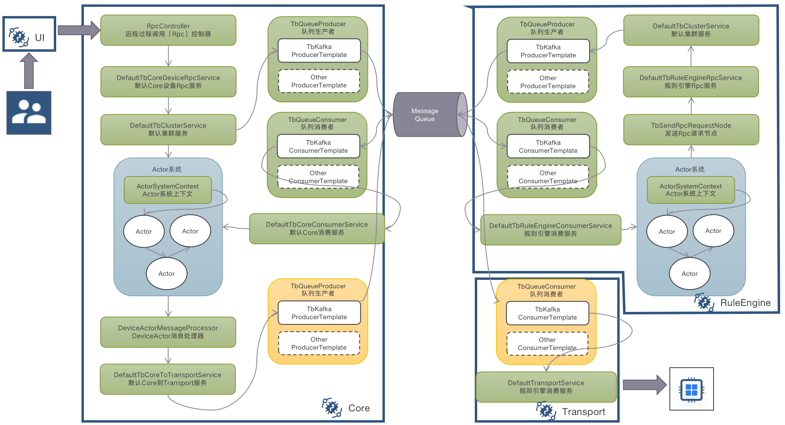
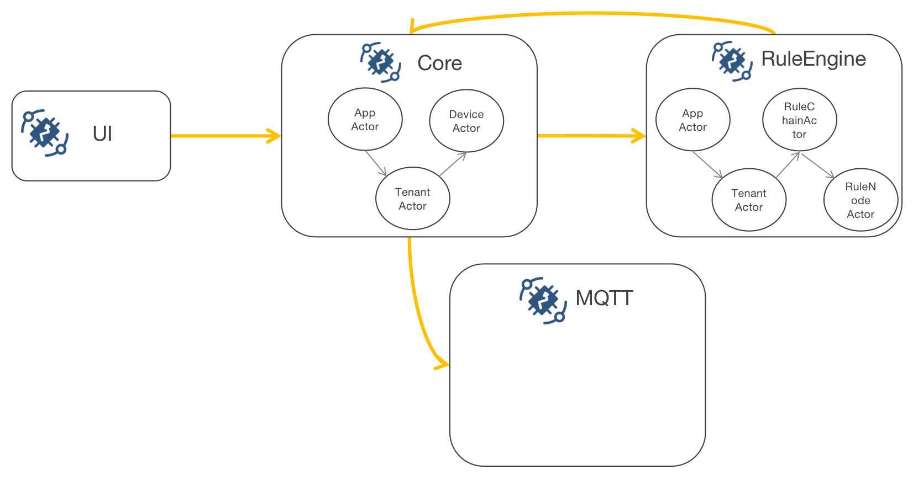

#### 环境准备

- release-3.2分支源码

#### 描述

设备控制流程涵盖系统多个部分，阅读[MVC分层](MVC分层.md)、[规则引擎](规则引擎.md)、[设备连接](设备连接.md) 、 [数据传输](数据传输.md) 有助于阅读本篇。

#### 分析

官方提供RPC（远程过程调用）功能，可从设备侧发起，也可有服务侧发起，服务侧发起又分为单路（One-way，不需要设备回自己）和双路（Two-way），这里以服务侧发起的普通设备双路RPC请求为例。

入口类：`RpcController`，核心流程如下：

```
//RpcController 94
return handleDeviceRPCRequest(false, new DeviceId(UUID.fromString(deviceIdStr)), requestBody);

//RpcController 122
deviceRpcService.processRestApiRpcRequest(rpcRequest, fromDeviceRpcResponse -> reply(new LocalRequestMetaData(rpcRequest, currentUser, result), fromDeviceRpcResponse));

//DefaultTbCoreDeviceRpcService 102
sendRpcRequestToRuleEngine(request);

//DefaultTbCoreDeviceRpcService 171
clusterService.pushMsgToRuleEngine(msg.getTenantId(), msg.getDeviceId(), tbMsg, null);

//DefaultTbClusterService 154
//调用ruleEngineMsgProducer（类型为TbQueueProducer）发送消息
//TbQueueProducer有多种实现，常见的是InMemoryTbQueueProducer和TbKafkaProducerTemplate
producerProvider.getRuleEngineMsgProducer().send(tpi, new TbProtoQueueMsg<>(tbMsg.getId(), msg), callback);

//DefaultTbRuleEngineConsumerService 165
List<TbProtoQueueMsg<ToRuleEngineMsg>> msgs = consumer.poll(pollDuration);

//DefaultTbRuleEngineConsumerService 185
forwardToRuleEngineActor(configuration.getName(), tenantId, toRuleEngineMsg, callback);

//DefaultTbRuleEngineConsumerService 300
msg = new QueueToRuleEngineMsg(tenantId, tbMsg, relationTypes, toRuleEngineMsg.getFailureMessage());
actorContext.tell(msg);

//省略部分Actor过程，可参见规则引擎
//AppActor --> TenantActor --> RuleChainActor --> RuleNodeActor -->TbNode.....

//TbSendRPCRequestNode 113
//获取RPC服务（类型为TbRuleEngineDeviceRpcService，实际是DefaultTbRuleEngineRpcService），调用sendRpcRequestToDevice处理Rpc请求消息。
ctx.getRpcService().sendRpcRequestToDevice(request, ruleEngineDeviceRpcResponse -> {
    if (!ruleEngineDeviceRpcResponse.getError().isPresent()) {
        TbMsg next = ctx.newMsg(msg.getQueueName(), msg.getType(), msg.getOriginator(), msg.getMetaData(), ruleEngineDeviceRpcResponse.getResponse().orElse("{}"));
        ctx.enqueueForTellNext(next, TbRelationTypes.SUCCESS);
    } else {
        TbMsg next = ctx.newMsg(msg.getQueueName(), msg.getType(), msg.getOriginator(), msg.getMetaData(), wrap("error", ruleEngineDeviceRpcResponse.getError().get().name()));
        ctx.tellFailure(next, new RuntimeException(ruleEngineDeviceRpcResponse.getError().get().name()));
    }
});

//DefaultTbRuleEngineRpcService 105
forwardRpcRequestToDeviceActor(request, response -> {
    if (src.isRestApiCall()) {
        sendRpcResponseToTbCore(src.getOriginServiceId(), response);
    }
    consumer.accept(RuleEngineDeviceRpcResponse.builder()
            .deviceId(src.getDeviceId())
            .requestId(src.getRequestId())
            .error(response.getError())
            .response(response.getResponse())
            .build());
});

//DefaultTbRuleEngineRpcService 134
sendRpcRequestToDevice(request);


//DefaultTbRuleEngineRpcService 144
//如果是service为monolith(单体架构)，即单体架构下
//直接获取tbCoreRpcService，调用forwardRpcRequestToDeviceActor处理Rpc消息
tbCoreRpcService.get().forwardRpcRequestToDeviceActor(rpcMsg);
//DefaultTbRuleEngineRpcService 150
//如果service为tb-rule-engine（也就是在微服务集群架构下，服务类型为RuleEngine），即微服务架构下
//则调用clusterService（类型为TbClusterService）的pushMsgToCore方法处理rpc消息
//clusterService.pushMsgToCore(rpcMsg, null);


//DefaultTbCoreDeviceRpcService 124
//单体架构下，直接调用actorContext的tellWithHighPriority方法以高优先级处理Rpc消息
actorContext.tellWithHighPriority(rpcMsg);

//DefaultTbClusterService 107
//微服务架构下，获取TbCoreMsgProducer发送消息
producerProvider.getTbCoreMsgProducer().send(tpi, new TbProtoQueueMsg<>(msg.getDeviceId().getId(), toCoreMsg), callback);
 
//DefaultTbCoreConsumerService 172
//微服务架构下，Tb-core消费消息
List<TbProtoQueueMsg<ToCoreMsg>> msgs = mainConsumer.poll(pollDuration);

//DefaultTbCoreConsumerService 194
//微服务架构下，调用forwardToDeviceActor方法处理消息
forwardToDeviceActor(toCoreMsg.getToDeviceActorMsg(), callback);

//DefaultTbCoreConsumerService 413
//微服务架构下，调用actorContext的tell方法处理消息
actorContext.tell(new TransportToDeviceActorMsgWrapper(toDeviceActorMsg, callback));


//省略部分Actor过程
//AppActor --> TenantActor --> DeviceActor --> DeviceActorMessageProcessor 


//DeviceActorMessageProcessor 144
sendToTransport(rpcRequest, key, value.getNodeId());

//DeviceActorMessageProcessor 497
systemContext.getTbCoreToTransportService().process(nodeId, msg);

//DefaultTbCoreToTransportService 52
process(nodeId, msg, null, null);

//DefaultTbCoreToTransportService 61
//tbTransportProducer（类型为TbQueueProducer）发送消息
//TbQueueProducer有多种实现，常见的是InMemoryTbQueueProducer和TbKafkaProducerTemplate
tbTransportProducer.send(tpi, queueMsg, new QueueCallbackAdaptor(onSuccess, onFailure));


//DefaultTransportService 199
processToTransportMsg(record.getValue());


//DefaultTransportService 615
listener.onToDeviceRpcRequest(toSessionMsg.getToDeviceRequest());

//DefaultTransportService 697
//获取PayloadAdaptor（载荷适配器）转换MqttTransport，并使用会话中的channel写入并刷新消息，载荷适配器通常有JsonMqttAdaptor、ProtoMqttAdaptor两种实现。
deviceSessionCtx.getPayloadAdaptor().convertToPublish(deviceSessionCtx, rpcRequest).ifPresent(deviceSessionCtx.getChannel()::writeAndFlush);


```

单体架构下示意图如下：


微服务架构下示意图如下：


从更宏观的角度看：



#### TIPS

- 官方RPC说明 [rpc](https://thingsboard.io/docs/user-guide/rpc/)
- 在一般情况下，反向控制通过网关进行（考虑到网络等因素），官方文档：[what-is-iot-gateway](https://thingsboard.io/docs/iot-gateway/what-is-iot-gateway/)
- https://thingsboard.io/docs/user-guide/integrations/decode/#step-1-connection

