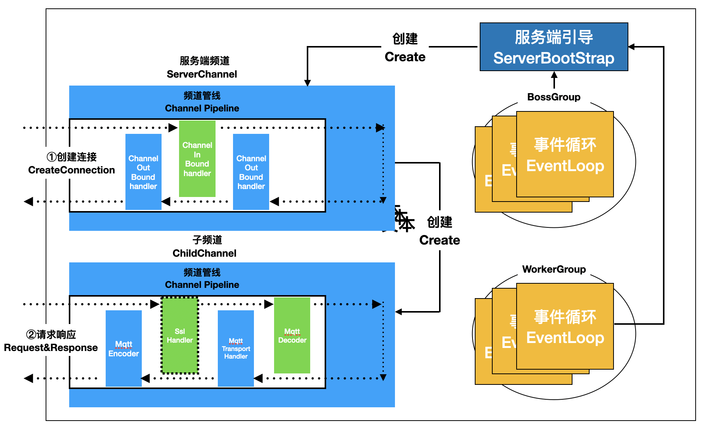

#### 环境准备

- release-3.2分支源码


#### 描述
以MQTT协议接入为例，分析Thingsboard如何完成设备连接，使用Mqtt客户端连接服务端只需发送CONNECT消息，等待服务端返回CONNACK消息即可，示意图如下：


#### 分析
入口：`MqttTransportService`

#### 初始化

##### 服务端
通过 init方法进行初始化，主要是使用Netty构造服务端并完成监听。
```
log.info("Setting resource leak detector level to {}", leakDetectorLevel);
//设置内存泄漏检测级别
ResourceLeakDetector.setLevel(ResourceLeakDetector.Level.valueOf(leakDetectorLevel.toUpperCase()));

log.info("Starting MQTT transport...");
//创建主循环组
bossGroup = new NioEventLoopGroup(bossGroupThreadCount);
//创建工作循环组
workerGroup = new NioEventLoopGroup(workerGroupThreadCount);
//创建服务端引导实例并设置
ServerBootstrap b = new ServerBootstrap();
b.group(bossGroup, workerGroup)
        .channel(NioServerSocketChannel.class)
        .childHandler(new MqttTransportServerInitializer(context))
        .childOption(ChannelOption.SO_KEEPALIVE, keepAlive);
//监听地址和端口
serverChannel = b.bind(host, port).sync().channel();
log.info("Mqtt transport started!");
```
##### 管道
当有客户端连接时，MqttTransportServerInitializer初始化管道处理链
```
//获取channel管道
ChannelPipeline pipeline = ch.pipeline();
String remoteAddress = ch.remoteAddress().toString();
log.info("init channel for address: [{}]",remoteAddress);
SslHandler sslHandler = null;
//如果有SslHandlerProvider，增加ssl handler
if (context.getSslHandlerProvider() != null) {
    sslHandler = context.getSslHandlerProvider().getSslHandler();
    pipeline.addLast(sslHandler);
}
//增加Mqtt解码器到管道
pipeline.addLast("decoder", new MqttDecoder(context.getMaxPayloadSize()));
//增加Mqtt编码器到管道
pipeline.addLast("encoder", MqttEncoder.INSTANCE);
//新建Mqtt处理Handler，用于处理Mqtt消息
MqttTransportHandler handler = new MqttTransportHandler(context, sslHandler);
//增加MqttHandler到管道
pipeline.addLast(handler);
//channel关闭监听增加MqttHandler
ch.closeFuture().addListener(handler);
```

初始化示意图如下：


#### 设备连接
在MqttTransportHandler中进行Mqtt消息处理，以一个认证为AccessToken的设备进行连接举例，核心处理流程如下：
```
//MqttTransportHandler 132
processMqttMsg(ctx, (MqttMessage) msg);


//MqttTransportHandler 154
processConnect(ctx, (MqttConnectMessage) msg);

//MqttTransportHandler 474
processAuthTokenConnect(ctx, msg);

//MqttTransportHandler 492
//构造请求消息，调用transportService处理请求消息
transportService.process(DeviceTransportType.MQTT, request.build(),


//DefaultTransportService 271
//调用doProcess方法处理protoMsg消息，protoMsg中包含请求消息。
doProcess(transportType, protoMsg, callback);


//DefaultTransportService 283
//调用transportApiRequestTemplate的send方法处理消息，根据结果构造ValidateDeviceCredentialsResponseBuilder
ListenableFuture<ValidateDeviceCredentialsResponse> response = Futures.transform(transportApiRequestTemplate.send(protoMsg), tmp -> {


//DefaultTbQueueRequestTemplate 180
//构造TopicPartitionInfo，使用requestTemplate（类型为TbQueueProducer）发送请求到指定消息队列的指定TOPIC中，TbQueueProducer有多种实现，常见的是InMemoryTbQueueProducer和TbKafkaProducerTemplate
requestTemplate.send(TopicPartitionInfo.builder().topic(requestTemplate.getDefaultTopic()).build(), request, new TbQueueCallback() {

//InMemoryTbQueueProducer 42 （作为requestTemplate的实现，在单体架构下调用）
//调用storage（ConcurrentHashMap+LinkedBlockingQueue）存放消息，根据结果设置callback
boolean result = storage.put(tpi.getFullTopicName(), msg);
if (result) {
    if (callback != null) {
        callback.onSuccess(null);
    }
} else {
    if (callback != null) {
        callback.onFailure(new RuntimeException("Failure add msg to InMemoryQueue"));
    }
}

//TbKafkaProducerTemplate 82 （作为requestTemplate的实现，在微服务架构下设置消息队列为kafka时使用，其他消息队列类似）
//使用Kafka生产者向Borker中发送消息，等待处理结果，然后根据异常是否为空callback对应属性。
producer.send(record, (metadata, exception) -> {
    if (exception == null) {
        if (callback != null) {
            callback.onSuccess(new KafkaTbQueueMsgMetadata(metadata));
        }
    } else {
        if (callback != null) {
            callback.onFailure(exception);
        } else {
            log.warn("Producer template failure: {}", exception.getMessage(), exception);
        }
    }
});


//DefaultTbQueueResponseTemplate 116
//调用DefaultTransportApiService处理请求，获取响应
AsyncCallbackTemplate.withCallbackAndTimeout(handler.handle(request),

//DefaultTbQueueResponseTemplate 120
//调用responseTemplate（类型为TbQueueProducer）发送请求TbQueueProducer将响应发送到指定消息中间件的指定TOPIC中，TbQueueProducer有多种实现，常见的是InMemoryTbQueueProducer和TbKafkaProducerTemplate
responseTemplate.send(TopicPartitionInfo.builder().topic(responseTopic).build(), response, null);

//InMemoryTbQueueProducer 42 （作为responseTemplate的实现，在单体架构下调用）
//同上

//TbKafkaProducerTemplate 82 （作为responseTemplate的实现，在微服务架构下设置消息队列为kafka时使用，其他消息队列类似）
//同上


//MqttTransportHandler 646
//调用transportService处理结果消息
transportService.process(deviceSessionCtx.getSessionInfo(),DefaultTransportService.getSessionEventMsg(SessionEvent.OPEN), new TransportServiceCallback<Void>() {
        

//DefaultTransportService 360
//调用sendToDeviceActor处理会话信息
sendToDeviceActor(sessionInfo, TransportToDeviceActorMsg.newBuilder().setSessionInfo(sessionInfo)
                    .setSessionEvent(msg).build(), callback);
                    
//DefaultTransportService 760
//调用tbCoreMsgProducer（类型为TbQueueProducer）往消息中间件发送请求
tbCoreMsgProducer.send(tpi,
        new TbProtoQueueMsg<>(getRoutingKey(sessionInfo),
 ToCoreMsg.newBuilder().setToDeviceActorMsg(toDeviceActorMsg).build()),
        wrappedCallback);
        
//InMemoryTbQueueProducer 42 （作为tbCoreMsgProducer的具体实现，在单体架构下调用）
//同上

//TbKafkaProducerTemplate 82 （作为tbCoreMsgProducer的具体实现，在微服务架构下设置消息队列为kafka时使用，其他消息队列类似）
//同上


//MqttTransportHandler 651
//channel上下文中写入并刷新CONNACK消息。
ctx.writeAndFlush(createMqttConnAckMsg(CONNECTION_ACCEPTED, connectMessage));
```


以单体架构为例，去掉线程池以及其他可排除的时序，形成的时序图如下：
//todo 配图


以微服务架构使用Kafka为消息队列为例，去掉线程池以及其他可排除的时序，形成的时序图如下：
//todo 配图

#### 注意事项

- 消息队列key计算：//todo
- TOPIC，请求TOPIC： `queue.transport_api.requests_topic`，返回结果TOPIC：`queue.transport_api.responses_topic`+`service.id`


#### TIPS

- [MQTT协议中文版](https://github.com/mcxiaoke/mqtt)
- [MQTT中文网](http://mqtt.p2hp.com/)
- [Netty官方](https://netty.io/)